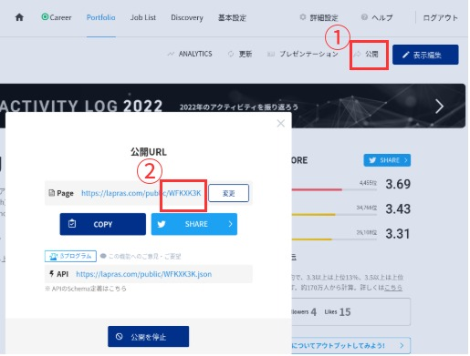

[](https://goreportcard.com/report/github.com/nao1215/go-lapras)

# go-lapras - LAPRAS API Goライブラリ
go-laprasは、[LAPRAS inc.が公開しているAPI](https://github.com/lapras-inc/public-api-schema)をGo言語から実行するためのライブラリです。なお、開発者である私はLAPRAS inc.と無関係の立場です。

現在LAPRAS inc.から公開されているAPIは以下の一点のみであり、本ライブラリが対応しているAPIも1点のみです。
```
GET https://lapras.com/public/<:share_id>.json
```
上記の`:share_id`には、ユーザーごとに異なるIDが入ります。自身の`:share_id`を知りたい場合は、[LAPRASのPortfolioページ](https://lapras.com/person)の公開ボタンを押下すると確認できます。


## API レスポンス
正確な情報は、[公式ドキュメント](https://github.com/lapras-inc/public-api-schema#response)をご確認ください。レスポンスデータは、大別して以下のとおりです。
- ユーザーの基本情報
- ユーザーのスコア情報
- Qiitaに投稿した記事の情報
- Zennに投稿した記事の情報
- Blogに投稿した記事の情報
- noteに投稿した記事の情報
- SpeakerDeckに投稿したスライドの情報
- GitHubに公開したRepositoryの情報
- teratailで回答した内容
- イベント酸化情報
- アクティビティログ

go-laprasライブラリは、上記のデータを操作するための構造体を定義しています。
```
// Person is the information of one LAPRAS user
type Person struct {
	// Name is user name.
	Name string `json:"name"`
	// Description is personal information to be filled in by the user.
	Description string `json:"description"`
	// EScore is Engineering score
	EScore float64 `json:"e_score"`
	// BScore is Business score
	BScore float64 `json:"b_score"`
	// IScore is Influences score
	IScore float64 `json:"i_score"`
	// QiitaArticles is slice of Qiita article
	QiitaArticles []QiitaArticle `json:"qiita_articles"`
	// ZennArticles is slice of Zenn article
	ZennArticles []ZennArticle `json:"zenn_articles"`
	// BlogArticles is slice of Blog article
	BlogArticles []BlogArticle `json:"blog_articles"`
	// NoteArticles is slice of Note article
	NoteArticles []NoteArticle `json:"note_articles"`
	// SpeakerDeckSlides is slice of SpeakerDeck slide information.
	SpeakerDeckSlides []SpeakerDeckSlide `json:"speaker_deck_slides"`
	// GithubRepositories is slice of github repository information
	GithubRepositories []GithubRepository `json:"github_repositories"`
	// TeratailReplies is slice of teratail reply information
	TeratailReplies []TeratailReply `json:"teratail_replies"`
	// TeratailReplies is slice of event
	Events []Event `json:"events"`
	// Activities is slice of activity log
	Activities []Activity `json:"activities"`
}
```

## go-lapras ライブラリの使い方
```
package main

import (
	"fmt"
	"io"
	"os"

	"github.com/nao1215/go-lapras/go-lapras"
)

func main() {
	lapras := lapras.NewLapras()
	person, err := lapras.GetPerson(os.Args[1]) // os.Args[1]は、share_id
	if err != nil {
		fmt.Fprintf(os.Stderr, err.Error())
		os.Exit(1)
	}

	fmt.Printf("Name             :%s\n", person.Name)
	fmt.Printf("Engineering Score:%v\n", person.EScore)
	fmt.Printf("Business Score   :%v\n", person.EScore)
	fmt.Printf("Score Influense  :%v\n", person.EScore)
	fmt.Println()

	for _, v := range person.GithubRepositories {
		if v.IsOwner && v.StargazersCount > 10 {
			fmt.Printf("Title       :%s\n", v.Title)
			fmt.Printf("Description :%s\n", v.Description)
			fmt.Printf("Stargazers  :%v\n", v.StargazersCount)
			fmt.Println()
		}
	}
}
```

以下、出力例です。LAPRAS inc. APIレスポンスの一部だけ出力している点に注意してください。
```
Name             :CHIKAMATSU Naohiro
Engineering Score:3.69
Business Score   :3.69
Score Influense  :3.69

Title       :nao1215/gup
Description :gup - Update binaries installed by "go install" with goroutines.
Stargazers  :160

Title       :nao1215/mimixbox
Description :MimixBox - mimic BusyBox on Linux
Stargazers  :24

Title       :nao1215/sqly
Description :sqly - eaisly execute SQL against CSV/TSV/LTSV/JSON with shell.
Stargazers  :24

Title       :nao1215/mkgoprj
Description :mkgoprj - Golang project template generator
Stargazers  :15
```

## 連絡先
テストを殆どしていないため、バグが潜んでいるはずです。バグに関するご報告は、GitHub Issueまでお願いいたします。報告は日本語で構いません。

## ライセンス
MIT License - Copyright (c) 2022 CHIKAMATSU Naohiro